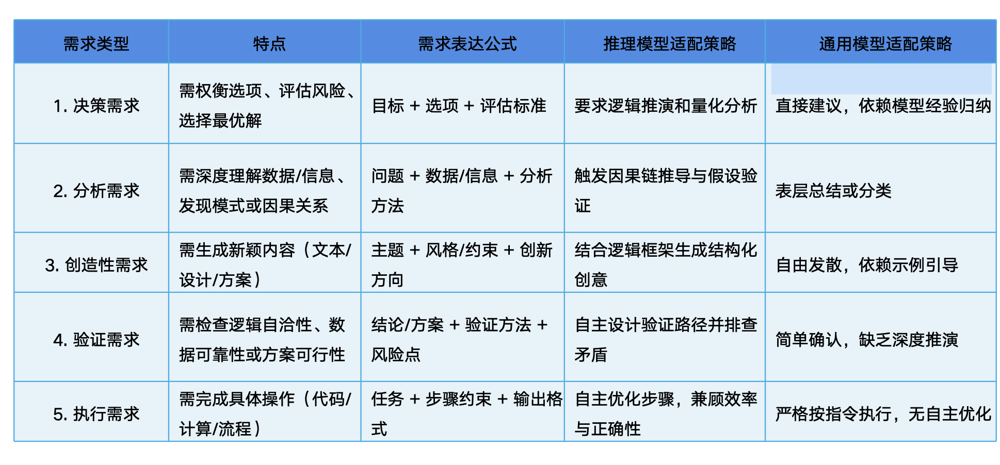

## 术语相关

AGI 全称为人工通用智能（Artificial General Intelligence）。

## 能做什么

- 文本生成
  -- 文本创作 (文章/故事/诗歌写作； 营销文案、广告语生成；社交媒体帖子；剧本或对话设计)
  -- 文本摘要改写 (论文摘要；文本简化；多语言翻译)
  -- 结构化生成 (日程安排 菜谱 代码注释 )

- 自然语言理解与分析NLP
  -- 语义分析  (语义解析；情感分析：评论；意图识别：客服对话用户查询；实体提取)
  -- 知识推理 (逻辑问题解答 因果分析)
  -- 文本分类(主题标签生成；垃圾内容检测)

- 编程代码相关
  -- 代码生成 自动补全、注释生成
  -- 代码调试 错误分析与修复建议、代码优化
  -- 技术文档处理 API文档生成；代码库解释与示例生成
- 常规绘图
  -- svg
  -- Mermaid图表 流程图、时序图、类图
  -- React图表 折线图、柱状图等

## 如何使用
### 推理模型
推理大模型： 传统LLM模型上，强化推理、逻辑分析和决策能力的模型 例如DeepSeekR1 Gpt-o3
非推理达模型：测中语言生成、语言理解、文本分类、翻译等任务。例如GPT-3 GPT-4 BERT

### 快思慢想：效能兼顾

### 提示语策略差异
1. 推理模型：简洁、明确任务目标和需求。无需逐步指导，模型自动生成结构化推理过程
2. 通用模型：需要显式引导推理过程（如通过CoT提示）；依赖提示语补偿能力短板

### 关键原则
1. 模型选择：根据任务类型选择。数学任务选推理模型，创意任务选通用模型
2. 提示语设计
+ 推理模型：简洁指令，聚焦目标 （要什么直接说）
+ 通用模型： 结构化 补偿性引导（缺什么补什么）
3. 谜面误区
+ 推理模型：不使用“启发式”提示（角色扮演）
+ 通用模型： 补过度信任，复杂问题，需要分步验证结果

### 下达指令->表达需求

### 任务需求与提示语策略

### 如何向AI表达需求

