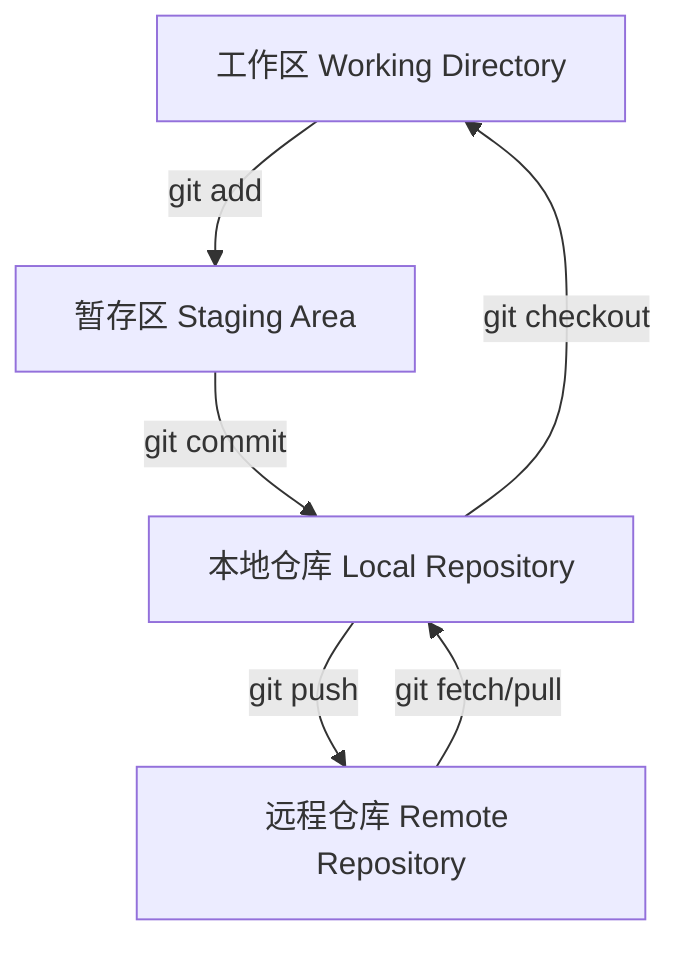

## 工作区与暂存区

### 工作区

本地目录，不包括 `.git` 目录。

### 版本库

工作区中有一个隐藏目录 `.git`，这个不算工作区，而是Git的版本库。

Git的版本库里存在很多东西，其中最为重要的是 stage（或者叫 index）的暂存区。还有Git为我们自动创建的第一个分支 master，以及指向 master 的第一个指针叫 HEAD。

```
工作区目录
├── .git/          # Git版本库
│   ├── index      # 暂存区
│   ├── HEAD       # 指向当前分支的指针
│   └── objects/   # 对象存储
├── 文件1          # 工作区文件
└── 文件2
```

### 文件状态流转

1. **git add**：把文件（修改之后的文件）添加进去，实际上是把文件修改添加到暂存区
2. **git commit**：提交更改，实际上就是把暂存区的所有内容提交到当前分支

### 工作流程图



## Git 基本概念

### 分支（Branch）

Git 的分支模型是其最强大的特性之一。与许多其他版本控制系统不同，Git 鼓励频繁使用分支和合并。

### 提交（Commit）

每次提交都会创建一个快照，保存当前所有文件的完整状态。每个提交都有一个唯一的 SHA-1 哈希值作为标识。

### HEAD

HEAD 是一个指针，指向当前所在的分支。当你切换分支时，HEAD 会指向新的分支。

### 远程仓库（Remote）

远程仓库是存储在网络上的项目版本，通常托管在 GitHub、GitLab 或 Bitbucket 等平台上。

## 基本工作流程

1. **修改文件**：在工作区修改文件
2. **暂存文件**：使用 `git add` 将修改添加到暂存区
3. **提交更改**：使用 `git commit` 将暂存区的更改提交到本地仓库
4. **推送到远程**：使用 `git push` 将本地提交推送到远程仓库
5. **拉取更新**：使用 `git pull` 从远程仓库拉取最新更改

## 常用命令

```bash
# 初始化仓库
git init

# 克隆远程仓库
git clone <repository-url>

# 查看状态
git status

# 添加文件到暂存区
git add <file>

# 提交更改
git commit -m "提交信息"

# 查看提交历史
git log

# 推送到远程仓库
git push

# 拉取远程更新
git pull
```

## 最佳实践

1. **频繁提交**：小步快跑，每次提交都应该是一个逻辑完整的更改
2. **有意义的提交信息**：清晰描述本次提交做了什么
3. **合理使用分支**：为每个功能或修复创建单独的分支
4. **及时拉取更新**：保持与远程仓库的同步
5. **代码审查**：在合并前进行代码审查